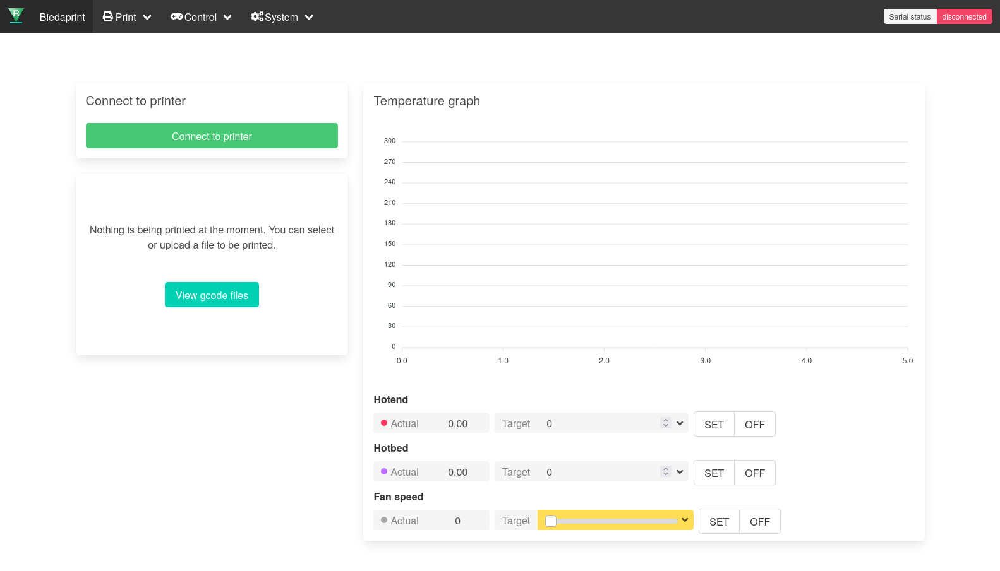
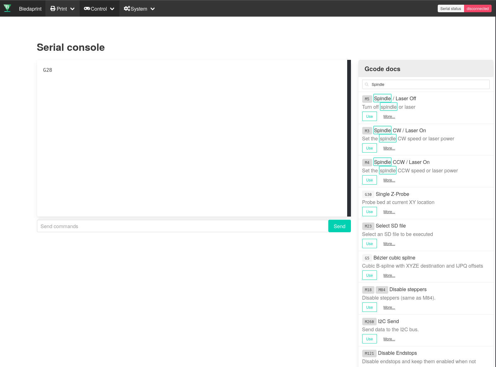

# biedaprint

A simple 3D printer web interface written in Golang and Vue.js. It can run on really low-power devices such as the steam-link. It consumes less resources than Octoprint. 

Main interface



Gcode console with built-in docs.



You can download prebuilt binaries from the Releases page.


# Building

To build with multiplatform cross-compiling you will need to install armv7 and aarch64 gcc cross-compilers.

Arch linux:
```
# pacman -S arm-linux-gnueabi-gcc aarch64-linux-gnu-gcc
```

Debian/Ubuntu:
```
# apt install gcc-arm-linux-gnueabi gcc-aarch64-linux-gnu
```

